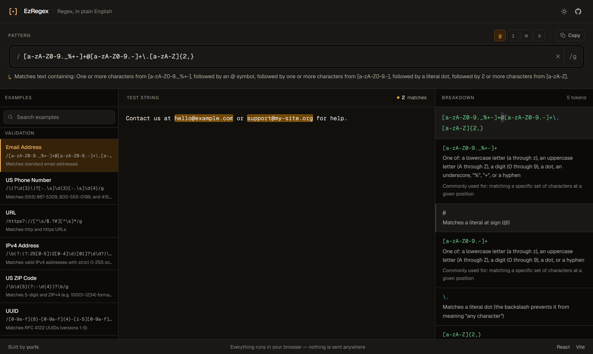

<div align="center">
  

  # EzRegex

  **Regex made readable.**

  [](https://ezregex.vercel.app)
  [](https://ezregex.vercel.app)
  [](https://react.dev)
  [](https://vitejs.dev)
  [](./LICENSE)

</div>

A visual regex playground with live match highlighting and plain-English breakdowns of every part of your pattern — no docs required.

**[Live demo →](https://ezregex.vercel.app)**

---



---

## Contents

- [Features](#features)
- [Getting started](#getting-started)
- [Scripts](#scripts)
- [How it works](#how-it-works)
- [Design](#design)
- [Project structure](#project-structure)
- [Tech stack](#tech-stack)
- [Deployment](#deployment)
- [License](#license)

---

## Features

- **Live match highlighting** — matches are highlighted in your test string as you type, using a transparent overlay that preserves cursor position and scroll
- **Plain-English breakdown** — every token in your regex (anchors, character classes, groups, quantifiers, and so on) is explained in human-readable language, one card per token
- **Bidirectional highlighting** — hover or click any coloured chunk in the pattern to highlight its explanation card, and vice versa
- **One-sentence summary** — a single natural-language sentence describing what the whole pattern matches, right under the input
- **Live match count** — a running total beside the test string, capped at 5,000 so a runaway pattern like `/a*/g` on a large paste cannot lock up the page
- **Copy the pattern** — one click puts `/pattern/flags` on the clipboard
- **29 categorised examples** — searchable library across Validation, Extraction, Cleanup, and Code, with live active-state highlighting
- **Flag toggles** — `g`, `i`, `m`, `s` with tooltip descriptions, fully keyboard accessible
- **Dark / light themes** — follows your OS by default, remembers your choice, and resolves before first paint so there is no flash
- **Responsive** — below 768 px the two panels become tabs and the examples list becomes a modal drawer
- **Accessible** — WCAG AA contrast verified for every text/background pair in both themes, full keyboard navigation, a focus-trapped drawer, and visible focus rings throughout

---

## Getting started

### Prerequisites

- **Node.js 20.19+ or 22.12+** (Vite 8 requires it) — check with `node -v`
- **npm** 10+, which ships with Node

### Install and run

```bash
git clone https://github.com/yuv1s/EzRegex.git
cd EzRegex
npm install
npm run dev
```

Vite prints a local URL — open it in your browser:

```
  VITE v8.0.10  ready in 320 ms

  ➜  Local:   http://localhost:5173/
```

The dev server hot-reloads on save. To use a different port, pass `npm run dev -- --port 3000`.

### Production build

```bash
npm run build     # outputs to dist/
npm run preview   # serve dist/ locally to check the real build
```

There is no backend, no API key, and no environment file — `dist/` is plain static assets you can host anywhere.

---

## Scripts

| Command | What it does |
|---|---|
| `npm run dev` | Start the Vite dev server with hot module reload |
| `npm run build` | Type-free production build into `dist/` |
| `npm run preview` | Serve the built `dist/` locally to verify the real bundle |
| `npm run lint` | Run ESLint across the project |

---

## How it works

### Match highlighting

The test string `<textarea>` sits on top of a transparent `<div>` (the "backdrop"). Matches are wrapped in `<mark>` elements inside the backdrop, which shows through the textarea's transparent text. This gives live highlighting without any `contenteditable` complexity.

The catch is that the two layers must wrap text *identically*, or the highlights drift off the words. Both carry the `.hl-layer` class in `src/index.css`, which owns every metric that affects wrapping — font, size, line height, letter spacing, padding, `white-space`, `overflow-wrap`, `word-break`, `tab-size`. Nothing that affects layout may be set on one layer alone.

### Plain-English breakdown

`src/lib/regexExplainer.js` is a hand-written tokenizer that walks the pattern character by character and emits typed *chunks*:

| Chunk type | Example | Description |
|---|---|---|
| `anchor` | `^`, `\b` | Start/end assertions |
| `shorthand` | `\d`, `\w`, `\s` | Built-in character classes |
| `charClass` | `[a-z0-9_]` | Custom character sets, with range detection |
| `group` | `(...)`, `(?:...)` | Capturing and non-capturing groups |
| `escape` | `\.`, `\n` | Escaped literals and special sequences |
| `quantifier` | `+`, `{2,5}?` | Repetition, attached to the preceding token |
| `alternation` | `\|` | Or-branches |
| `literal` | `abc` | Plain characters |

Each chunk carries a `description` and an optional `useCase`. `summarizeRegex` then folds the chunks into a single natural sentence, handling leading and trailing anchors and alternation branches.

---

## Design

The interface is deliberately near-monochrome. Colour is treated as a scarce resource and spent only where it carries meaning:

| Colour | Means |
|---|---|
| Ochre accent | a match, a selection, focus |
| Red | an invalid pattern |
| Pink / green / blue / cyan | the four regex token families — position, character set, structure, escape |
| Neutral | everything else, including plain literals |

Literals are left uncoloured on purpose. They are the bulk of most patterns, and colouring them is what turns a regex display into unreadable confetti.

The neutral ramp is a custom warm-grey scale defined in OKLCH in `src/index.css`, not Tailwind's stock grays. Every text-on-background pair in both themes was checked against WCAG AA (4.5:1 for text, 3:1 for focus rings). The tertiary text tone sits close to the secondary one because anything lighter fails that check — the hierarchy is carried by size and weight instead.

Accent values differ per theme, because no single hex clears 4.5:1 against both a near-white and a near-black background:

| Token | Light | Dark |
|---|---|---|
| `--ez-accent` | `#9E5900` | `#EFB05C` |
| `--ez-accent-fill` | `#AE5F00` | `#EDA343` |
| Match highlight | `#F7D18B` | `#724500` |

---

## Project structure

```
public/               favicons, PWA manifest
src/
  components/
    Header.jsx          wordmark, theme toggle, mobile drawer trigger
    PatternBar.jsx      pattern field, flag pills, copy, plain-English summary
    TestPanel.jsx       test string with the highlight overlay and match count
    BreakdownPanel.jsx  breakdown cards with bidirectional highlighting
    RegexDisplay.jsx    coloured, interactive regex chunk display
    Examples.jsx        examples list — desktop rail and mobile drawer
    Footer.jsx          attribution
  lib/
    regexEngine.js      parseRegex, getMatches, buildHighlightedHtml
    regexExplainer.js   tokenizer, chunk descriptions, summarizeRegex
    tokenStyles.js      token type -> colour family mapping
    useMediaQuery.js    matchMedia as external state, for ARIA roles only
  data/
    examples.json       29 categorised example regexes
  index.css             colour tokens, focus rings, highlight-layer metrics
  App.jsx               layout, state, theme, keyboard and focus wiring
```

---

## Tech stack

| | |
|---|---|
| Framework | React 19 + Vite 8 |
| Styling | Tailwind CSS v4, semantic colour tokens in OKLCH |
| Fonts | Geist (UI), Geist Mono (code) |
| Language | JavaScript (ESM, no TypeScript) |
| Regex engine | Native browser `RegExp` |
| Hosting | Vercel (free tier) |

---

## Deployment

The app is a static bundle with no backend, so any static host works.

For Vercel, import the repository and accept the detected defaults:

| Setting | Value |
|---|---|
| Framework preset | Vite |
| Build command | `npm run build` |
| Output directory | `dist` |
| Install command | `npm install` |

Everything runs client-side — patterns and test strings never leave the browser.

---

## License

[MIT](./LICENSE) © [yuv1s](https://github.com/yuv1s)

---

## Acknowledgements

Built by [yuv1s](https://github.com/yuv1s). AI-assisted scaffolding and boilerplate; the regex tokenizer and product decisions are hand-written.
